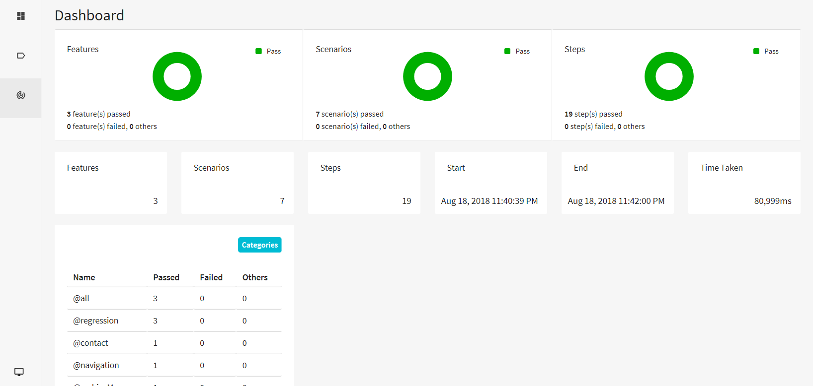
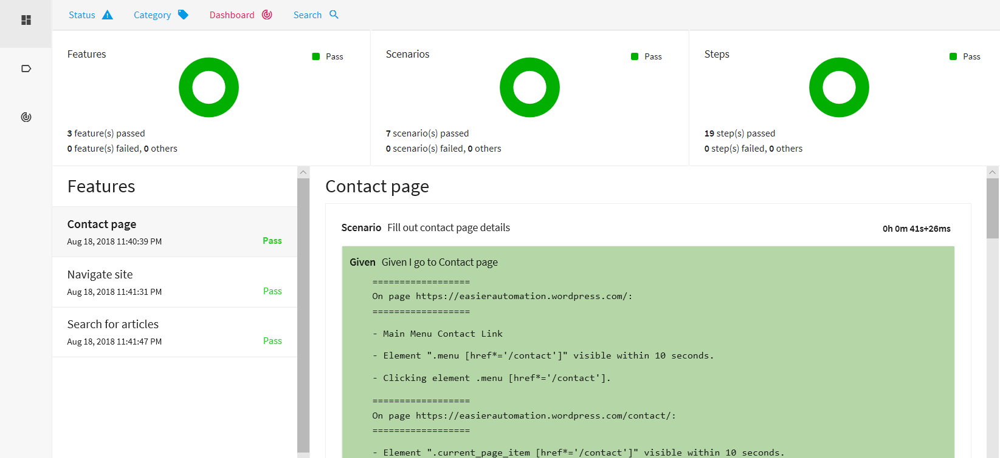

# Java, Cucumber, Maven, JUnit and Selenium Automation Test Framework

Basic automation test framework following action and page object models, using Selenium to interact with the web browser, Cucumber to frame the tests, and Extent for elegant reporting. Features built in support for local testing, Selenium Grid, and Browserstack, and uses Hamcrest for better reporting on test failures.

## Log Report Examples

## Software Requirements
* [Maven](https://maven.apache.org/)

To run the tests on Google Chrome:
* [ChromeDriver](https://sites.google.com/a/chromium.org/chromedriver/)
* Set a system variable of "webdriver.chrome.driver" to point to the file downloaded above, either permanently or as part of running Maven: `mvn test -Dwebdriver.chrome.driver=path/to/chromedriver`

To run the tests on Internet Explorer:
* [InternetExplorerDriver](https://github.com/SeleniumHQ/selenium/wiki/InternetExplorerDriver)
* Set a system variable of "webdriver.ie.driver" to point to the file downloaded above, either permanently or as part of running Maven: `mvn test -Dwebdriver.ie.driver=path/to/internetexplorerdriver`

To run the tests on Safari on OS X:
* [SafariDriver](https://github.com/SeleniumHQ/selenium/wiki/SafariDriver)
* Install the extension downloaded above into Safari

## Running the tests
* Open a terminal/command prompt and navigate to the root of the tests
* It's recommended to run the tests with `-Dcucumber.options` with the `@all` tag, to run all the test cases: `mvn test -Dcucumber.options="--tags @all"`
* To run tagged test cases, replace `@all` tag with the specific tag you want to run. For example, to run only `@search` tests, enter command: `mvn test -Dcucumber.options="--tags @search"`
* The above command will accurately generate the Extent Report, which is more informative than the standard Cucumber HTML reports.
* Running without `-Dcucumber.options` will cause a Null Pointer Exception with the Extent report writer, and won't generate the Extent report.

Reports from the test are output to the folder 'target', separated into folders based on report type.
However, if only run using mvn test, reports from the test are output to the folder 'reports', separated into folders based on date, platform and browser. This only outputs default Cucumber html and json reports.

You can also add additional configurations to the `mvn test` command:
* Passing through any of the config.properties values as system properties, e.g. `mvn test -Dbrowser=Firefox -DseleniumEnvironment=grid`
* Specifying a tag to run from the feature files, e.g. `mvn test -Dcucumber.tags=@search`

## Configuration
In the path src/test/resources is a 'config.properties' file. These are the valid configurations:
| Key        | Values           | Description  | Required? |
| ------------- |:-------------:| :-----| :-----|
| seleniumEnvironment      | local | Runs the tests directly on your machine| yes |
| | grid | Runs the tests on the Selenium Grid specified in 'seleniumHub' |
| | browserstack | Runs the tests on Browserstack using the 'browserstackUsername' and 'browserstackPassword' specified |
| browser | See 'Browser choices' section | Sets your browser based on the choices available in the enum | yes |
| browserVersion | | Sets the version of the browser you want to use when running on Selenium Grid or Browserstack. Must match the options you have set in your Selenium Grid or those supported by Browserstack | no |
| platform | See 'Platform choices' section | Sets your platform based on the choices available in the enum | no |
| platformVersion | | Sets the version of the platform you want to use when running on Selenium Grid or Browserstack. Must match the options you have set in your Selenium Grid or those supported by Browserstack | no |
| seleniumHub | Address of Selenium Hub | The address to your Selenium Grid hub, e.g. http://192.168.0.101:4444/wd/hub | Only when using seleniumEnvironment:grid |
| browserstackResolution | WxL | Resolution used by Browserstack | Only when using seleniumEnvironment:browserstack |
| browserstackUsername | | Username used by Browserstack | Only when using seleniumEnvironment:browserstack |
| browserstackPassword | | Automation key used by Browserstack | Only when using seleniumEnvironment:browserstack |
| browserstackProject | | Project name used by Browserstack | Only when using seleniumEnvironment:browserstack |
| browserstackBuild | | Build version used by Browserstack | Only when using seleniumEnvironment:browserstack |

### Browser choices
* IE
* Edge
* Safari
* Firefox
* Chrome
* Opera
* iPhone5
* iPhone5S
* iPadMini4
* iPadPro
* iPadAir
* iPad4
* SamsungGalaxyS5
* SamsungGalaxyS4
* SamsungGalaxyS3
* SamsungGalaxyNote2
* SamsungGalaxyNote3
* SamsungGalaxyS5Mini
* SamsungGalaxyTab410_1
* SamsungGalaxyNote10_1
* SamsungGalaxyTab3
* HTCOneM8
* HTCOneX
* MotorolaRazr
* MotorolaRazrMaxxHD
* SonyTipo
* GoogleNexus5
* GoogleNexus4
* GoogleNexus7
* AmazonKindleFire2
* AmazonKindleFireHD8_9
* AmazonKindleFireHDX7
* PhantomJS

Additonal browser choices can be added to the `browser.enum` file within the tests. The format is based on the style used by Browserstack, and your Selenium Grid must use the same stylings.

### Platform choices
* Windows
* OSX
* Ubuntu
* iOS
* Android

Additonal platform choices can be added to the `platform.enum` file within the tests. The format is based on the style used by Browserstack, and your Selenium Grid must use the same stylings.

### Important Links

[Official Website](http://selenium-grid.seleniumhq.org)

[Maven](https://maven.apache.org/)

[ChromeDriver](https://sites.google.com/a/chromium.org/chromedriver/)

[InternetExplorerDriver](https://github.com/SeleniumHQ/selenium/wiki/InternetExplorerDriver)

[SafariDriver](https://github.com/SeleniumHQ/selenium/wiki/SafariDriver)

[Selenium Documentation](http://seleniumhq.org/docs/)

[Browserstack](https://www.browserstack.com/)

[Hamcrest](http://hamcrest.org/)
